  

[//]: # (Build Status)

[//]: # (Code Coverage)

[//]: # (usage)

**Admiral provides automatic configuration and service discovery for multicluster Istio service mesh**

Istio has a very robust set of multi-cluster capabilities.  Managing this configuration across multiple clusters at scale is challenging.  Admiral takes an opinionated view on this configuration and provides automatic provisioning and syncing across clusters.

Admiral defines two custom resources, the [Dependency](./docs/Architecture.md#dependency) and [GlobalTrafficPolicy](./docs/Architecture.md#global-traffic-policy), which are used to configure ServiceEntries, VirtualServices, and DestinationRules on each cluster for each cross-cluster service. This removes the complexity for developers and mesh operators.

[Admiral Demo](https://www.youtube.com/watch?v=cwQpt1t287c)

## [Docs](./docs/Index.md)

## Who uses Admiral?

Organizations below are **officially** using Admiral. Please send a PR with your organization name if you are using Admiral.

* [Intuit](https://www.intuit.com/)

## Blogs and Presentations

* [Multicluster Istio configuration and service discovery using Admiral](https://istio.io/blog/2020/multi-cluster-mesh-automation/)

* [Stitching a Service Mesh Across Hundreds of Discrete Networks](https://www.youtube.com/watch?v=EWyNbBn1vns)

* [Scaling Service Mesh to an Enterprise Microservices Ecosystem](https://apiworld2019aidevworld2019.sched.com/event/SLIQ/pro-talk-scaling-service-mesh-to-an-enterprise-microservices-ecosystem)

* [Admiral – Enabling Multi-Cluster Mesh](https://www.meetup.com/San-Diego-Cloud-Native-Computing-Meetup/events/262826967/)

[//]: # (support)

## Collaboration and Communication

[Admiral Slack Channel](https://istio.slack.com/archives/CT3F18T08) 

`Note:` This channel is under Istio slack org, please fill out this [form](https://docs.google.com/forms/d/e/1FAIpQLSfdsupDfOWBtNVvVvXED6ULxtR4UIsYGCH_cQcRr0VcG1ZqQQ/viewform) to get access to Istio slack.

## Local Development
Refer to [Local Development Setup](./CONTRIBUTING.md#setting-up-for-local-development)

## Contributing
Refer to [Contributing doc](./CONTRIBUTING.md)

## Release Cadence

Details can be found [here](./docs/Processes.md)

## Admiral Sequence Diagram

### Legend:
SE - [Istio ServiceEntry](https://istio.io/latest/docs/reference/config/networking/service-entry/)

VS - [Istio VirtualService](https://istio.io/latest/docs/reference/config/networking/virtual-service/)

DR - [Istio DestinationRule](https://istio.io/latest/docs/reference/config/networking/destination-rule/)

K8s API - [Kubernetes API Server](https://kubernetes.io/docs/concepts/overview/kubernetes-api/)

GTP - [Admiral GlobalTrafficPolicy](https://github.com/istio-ecosystem/admiral/blob/master/docs/Architecture.md#global-traffic-policy)

```mermaid
sequenceDiagram
		autonumber 1
    Service/VirtualService Handler->>+Rollout/Deployment Handler: Add/Update/Delete events
		autonumber 1
    GTP/OutlierDetection Handler->>Update All Resources: Add/Update
    autonumber 1
    DependencyRecord Handler->>Update All Resources: Add/Update
		autonumber 1
		Rollout/Deployment Handler->>Update All Resources: Add/Update

    autonumber 2
    Update All Resources->>RemoteControllers: Fetch All Cluster Controllers
		rect rgb(255, 255, 220)
	    loop
		    Update All Resources->>K8sAPI 1..N: For each cluster, get corresponding service object
				K8sAPI 1..N-->>Update All Resources: Continue if service does not exist for deployment/rollout
				K8sAPI 1..N-->>Update All Resources: Build list of source services
	    end
		end
	  rect rgb(255, 255, 220)
	    loop
				Update All Resources->>K8sAPI 1..N: Derive SE from each service in the list
				Update All Resources->>GTP/OutlierDetection Cache: Derive DR from GTP/OutlierDetection
			  rect rgb(204, 255, 204)
			    loop
				    Update All Resources->>K8sAPI 1..N: Add/Update SE/DR/VS in source clusters
				    Update All Resources->>DynamoDB: Add/Update WorkloadData for source clusters
					end
		    end
	    end
		end

    Update All Resources->>DependencyCache: Fetch dependent clusters
		rect rgb(204, 255, 204)
	    loop
				Update All Resources->>K8sAPI 1..N: Add/Update SE/DR/VS in dependent clusters
        Update All Resources->>DynamoDB: Add/Update WorkloadData for dependent clusters
			end
		end
```

# Core contributors
- [Anil Attuluri](https://github.com/aattuluri)
- [Anubhav Aeron](https://github.com/nirvanagit)
- [Shriram Sharma](https://github.com/shriramsharma)
- [Kartikeya Pharasi](https://github.com/kpharasi)
- [Vinay Gonuguntla](https://github.com/vinay-g)
- [Vrushali Joshi](https://github.com/vrushalijoshi)
- [Viraj Kulkarni](https://github.com/virajrk)
- [Ryan Tay](https://github.com/rtay1188)
- [Punakshi Chaand](https://github.com/Punakshi)
- [Pankaj Sikka](https://github.com/psikka1)
