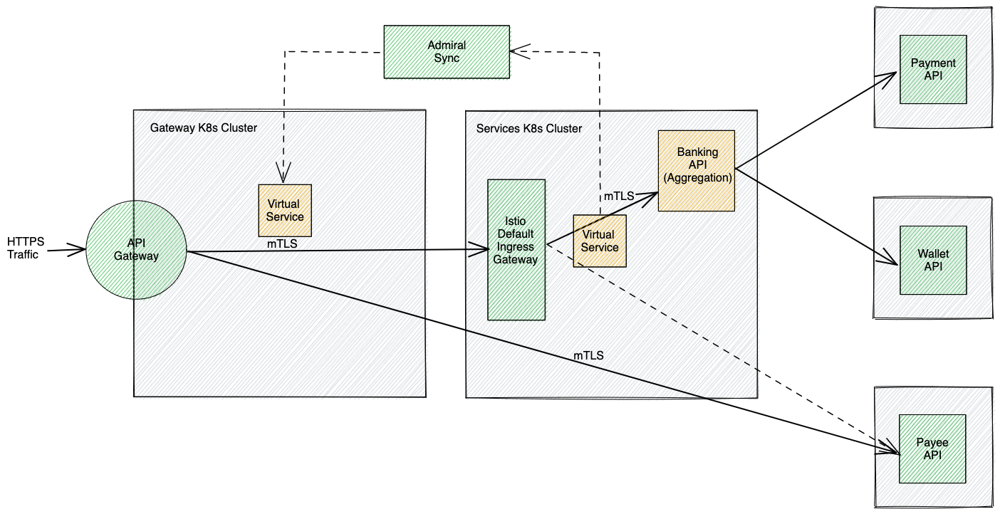
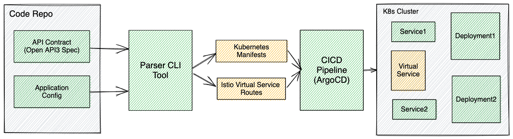

# An intuitive method to pursue REST API Orchestration with Istio and OpenAPI 3.0
## Introduction

Runtime orchestration for APIs is a paradigm that enables API owners to provide versatile customizations of their APIs at the edge e.g. serve mobile/web clients,  customize data fencing, apply regulatory transforms etc. Many solutions exist towards fulfilling this in Special Purpose Services Orchestration Layer (SPSOL), but, with growing emphasis towards "all things API" there is a need for a standard, modular orchestration framework that is 100% configuration-driven while it adheres to the following principles :
  - Enable dynamic plug&play thus removing shared maintainability aspects of SPSOL
  - Optimizing API response times by pruning extra hops seen on SPSOLs
  - Eliminate the need to rework existing domain apis as needed on some SPSOLs
  - Enable API governance & review by means of "Orchestration as code" using a proven API definition standard 

The solution thus shall be a framework that offers dynamic injection, end to end security and capabilities to abstract business logic while keeping the principles under purview.
<br />

OpenAPI 3.0 specification is the pervasive standard used for API contract definition. By leveraging the extensionsibility of OpenAPI, the solution shall define runtime orchestration constructs. API creators could leverage this to define their runtime semantics such that an off-the-shelf framework can dynamically load and link the attributes in the OpenAPI extension to the Istio substrate. This apparatus thus creates linkage between API defintions, Kubernetes resources and Istio VirtualServices along with routing rules et al towards optimized execution. The solution covers both north-south and east-west traffic manifestations. 

API runtime orchestration supports API patterns e.g.  

- API aggregation
- API transformation
- API Proxy 

In summary, the solution provides a comprehensive framework that enables declarative description of API orchestration and multiple possibilities thereof while offering dynamic linking to Istio in a low-code / no-code model.

## System Overview

Runtime orchestration is enabled in a combination of API Gateway and Istio Service Mesh set up for ingress routing towards service deployments. API Gateway being a Service0 in Mesh leverages mTLS and private networking to the domain services behind it. API Gateway runs on a dedicated Kubernetes cluster. API Gateway shall route the requests to target deployment via the default ingress gateway provided by Istio in the target cluster. Istio virtual services created in the domain service's Kubernetes cluster is replicated to other clusters by Admiral synchronization to enable the north-south and east-west routing of API traffic.


## Linking OpenAPI 3.0 Contract to Runtime Orchestration
Custom extensions `x-orx-containers` and `x-orx-proxies` are used in API contracts to indicate the API orchestration pattern. The parser CLI tool parses the API contract and generates the deployment, service and Istio virtual services to be deployed to the target Kubernetes cluster.
```sh
paths:
  /banking:
    x-orx-container:
      $ref: '#/components/x-orx-containers/api-aggregation-container'
    get:
      summary: Banking aggregation API
......
  /wallet:
    x-orx-proxy:
      $ref: '#/components/x-orx-proxies/api-proxy-service'
    get:
      summary: Wallets proxy API
......
  x-orx-containers:
    api-aggregation-container:
      image: docker.com/runtime-aggregation-code:latest
      containerPort: 8080
  x-orx-proxies:
    api-proxy-service:
      service: payee.company.mesh
      port: 8080
```


## System Architecture




## API Runtime Creation and Deployment




## Benefits to the Ecosystem

API orchestration is business-critical but the current integration and enablement with SPSOL is involved and time consuming. API runtime orchestration with Istio virtual services provides an agile path to API extensibility and customizations for developers. This orchestration layer can help deliver state of art APIs with more flexibility wherein requests and responses need splits, merges or re-routing. The orchestration layer can dynamically step inbetween the client requests and your API backend thus providing security, ensure protocols normalization, while handling data validations and error scenarios upstream. Orchestration APIs when coupled with appropriate AuthZ could help create custom data /functional fencing models. All these and many more potential benefits consumed in a low-code / no-code model.
