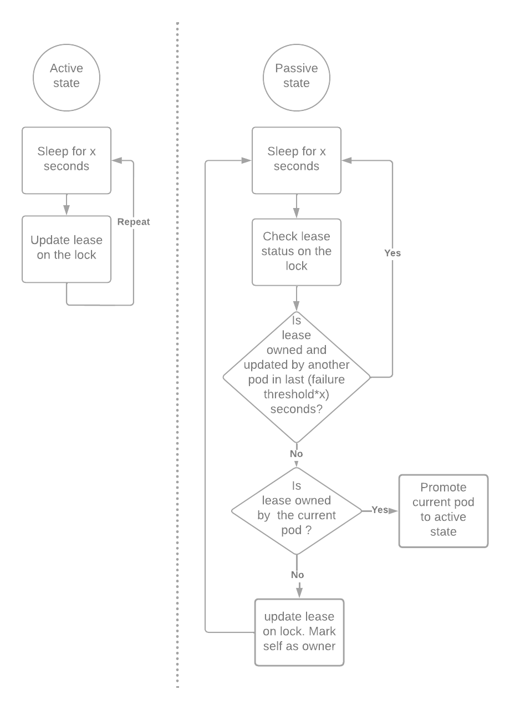
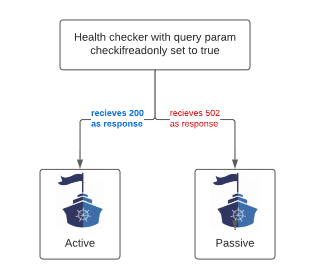
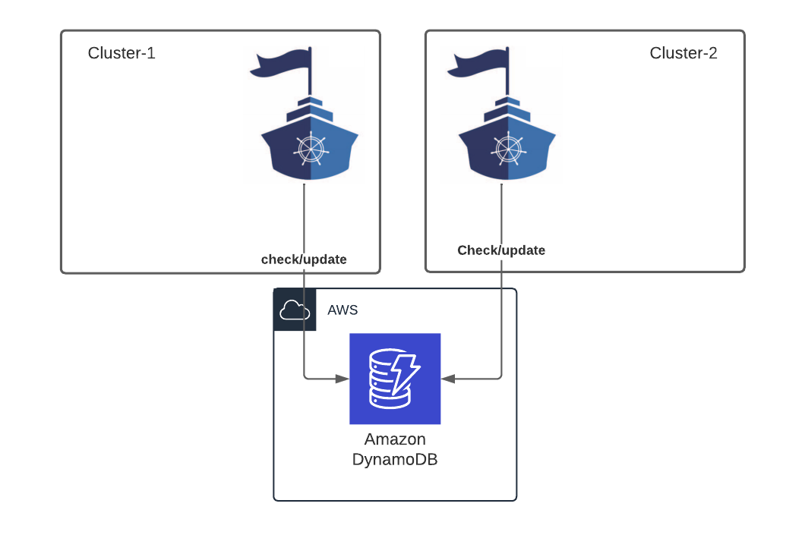
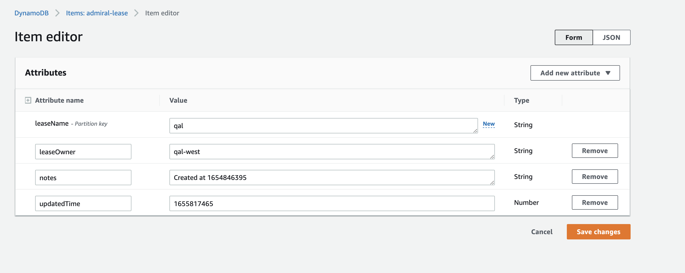

# Disaster recovery

## Key terms

### Active Admiral/Read-Write Admiral 
Admiral instance which is constantly monitoring all the clusters for changes and is responsible to creating , updating and deleting the Istio custom objects 
like Service Entry, Destination rule, Virtual Service , Sidecar and others.

### Passive Admiral/Read-only Admiral 
Admiral instance which constantly monitors all the clusters for changes but does not manipulate any Istio objects. This instance does not create, update or delete Istio custom objects.

### Lock object 
A reference object that is used to define if an Admiral instance is active or passive.

### Lease 
Duration for which the usage rights are obtained on a lock object.

## What is the need for this ?

As of this writing, we can only run one instance of Admiral in a Service mesh environment. We risk running into data inconsistency issues if Admiral is scaled out.
Multiple Admiral instances can overwrite Service Entry and other Istio custom objects and cause non-determistic behaviour.
Running only one instance of Admiral exposes us to the risk of not being able to modify Istio custom objects in case the Admiral instance is unresponsive or has network issue due to infrastructure failures.

In a Service mesh spanning multiple availability zones/DR regions, we need the ability to run passive Admiral instance that can take over the responsibility of
updating and creating Istio custom objects whenever the active instance encounters any issues.

## Admiral state changes 
* An Admiral instance gets promoted to Active state when it obtains a lease on the lock object.
* Once lease is obtained, the Active state Admiral keeps renewing the lease every x seconds.
* An Admiral instance in passive state keeps checking if the lease is updated every x seconds. If the lease is not updated for y*x seconds, where y is the failure threshold, the passive Admiral takes over as the Active state Admiral.




## Changes to health check API -
As of this writing, Admiral exposes REST APIs that can be used to check the current clusters being monitored and also data about various Istio custom objects.
As we consider data from Active state Admiral as the Source of truth, we need a way to direct all REST APIs to the active state Admiral. To support this, we have enhanced the health check endpoint to 
include an optional query param ```checkifreadonly```. If this query param is set to true, a passive state Admiral will return a 502 whereas an active state Admiral 
returns a successful response. This query param can be used to configure health check diagnostic URL to decide the active instance from a pool of Admiral instances.
Do not use this query param on [readiness or liveness check probes](https://kubernetes.io/docs/tasks/configure-pod-container/configure-liveness-readiness-startup-probes/).



## What is supported today ?
We have introduced Dynamo DB based DR solution for Admiral. The active and passive Admiral instances try to obtain lease on a lock object
maintained on a Dynamo DB table. Dynamo DB supports [Global tables](https://aws.amazon.com/dynamodb/global-tables/) which can help replicate lock object information between regions where Admiral is hosted.
Writes are supported on multiple regions.



## Configuration changes to use this
Create a DynamoDB table with below specifications. You can follow instructions provided [here](https://docs.aws.amazon.com/amazondynamodb/latest/developerguide/V2globaltables.tutorial.html#V2creategt_console) to create Global tables spanning your DR regions
```
Table name :- admiral-lease
Attribute names
leaseName type-string  Partition key
leaseOwner type-string 
notes  type-string 
updatedTime type-Number
```


Below is a sample config file that be used to configure Dynamo DB connection settings. This can be added as a configmap and made available to Admiral pod using [Volume mounts](https://kubernetes.io/docs/tasks/configure-pod-container/configure-volume-storage/)
```
dynamoDB:
leaseName: mylease
podIdentifierPrefix: myname
waitTimeInSeconds: 15
failureThreshold: 3
tableName: admiral-lease
role: arn:aws:iam::<awsaccountno>:role/<rolename>
region: us-west-2

```

Include below program arguments
```
--admiralStateCheckerName dynamodbbasedstatechecker
--drConfigFileLocation <some file location inside Admiral pod>
--seIPPrefix 242.0 
```
Please use different values for ```seIPPrefix ``` per Admiral deployments. This is needed to ensure that the same IP address is not used in diferent service entries which causes 404 issues with Istio.

## Creating custom DR solutions

To create your own implementation of DR, please create struct which implements below interface methods.

runStateCheck should have the logic for DR. This take AdmiralState type object as param and modifies the readonly flag to transition Admiral between Active and Passive modes
shouldRunOnIndependentGoRoutine should return true if you want the DR logic in run StateCheck method to run on a seperate GoRoutine.

```
type AdmiralStateChecker interface {
	runStateCheck(as *AdmiralState)
	shouldRunOnIndependentGoRoutine() bool
}
```
* Once you have the Struct which implements above interface methods, update the ```startAdmiralStateChecker``` function in Registry.Go file to invoke your handler.
* Invoke your custom implementation by setting the program argument --admiralStateCheckerName to a value used in ```startAdmiralStateChecker``` function
* Please contribute your implementation to this project

