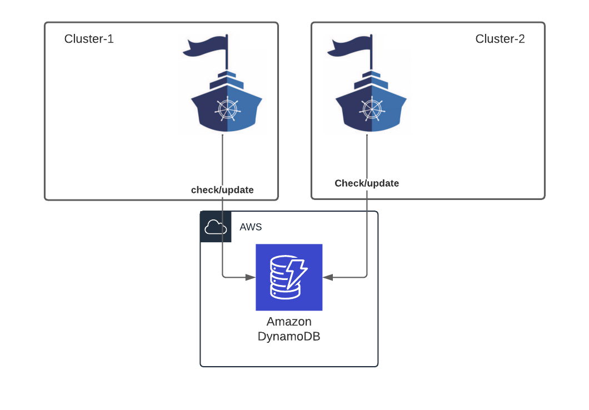
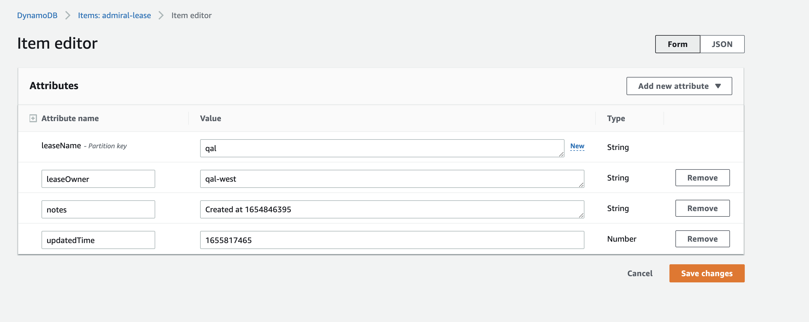

# Dynamo DB based DR sample

Below document explains how DynamoDB can be used to implement DR in Admiral. The active and passive Admiral instances try to obtain lease on a lock object
maintained on a Dynamo DB table. Dynamo DB supports [Global tables](https://aws.amazon.com/dynamodb/global-tables/) which can help replicate lock object information between regions where Admiral is hosted.
Writes are supported on multiple regions.




## Sample Code

Define the structs needed to unmarshall DynamoDB configs from Yaml file
```
package clusters

type DynamoDBConfigWrapper struct {
	DynamoDBConfig DynamoDBConfig `yaml:"dynamoDB,omitempty"`
}

/*
Reference struct used to unmarshall the DynamoDB config present in the yaml config file
*/
type DynamoDBConfig struct {
	LeaseName               string `yaml:"leaseName,omitempty"`
	PodIdentifier           string `yaml:"podIdentifier,omitempty"`
	WaitTimeInSeconds       int `yaml:"waitTimeInSeconds,omitempty"`
	FailureThreshold        int `yaml:"failureThreshold,omitempty"`
	TableName               string `yaml:"tableName,omitempty"`
	Role                    string `yaml:"role,omitempty"`
	Region                  string `yaml:"region,omitempty"`
}
```

Define new struct for DR implementation using Dynamo DB and provide implementation for necessary interface methods of ``` AdmiralStateChecker ``` interface
```
package clusters

import (
	"context"
	log "github.com/sirupsen/logrus"
	"time"
)

/*
The skip lease pod can be used for testing DynamoDB based DR.
Update the podname field to "SKIP-LEASE-POD" to test Admiral pods in passive mode.
*/
const SKIP_LEASE_CHECK_POD_NAME = "SKIP-LEASE-POD"

type DynamoDBBasedStateChecker struct {
	drConfigFileLocation string
}

func (DynamoDBBasedStateChecker) shouldRunOnIndependentGoRoutine() bool{
	return true;
}

/*
This method has the logic to update the ReadOnly field within the AdmiralState object based on the lease obtained on the shared lock object
The AdmiralState object is referenced everywhere in the code before trying to create/update/delete Istio custom objects

Below is the logic for Admiral instance in Active state
1. Get the latest lease information from DynamoDB table
2. If the current pod owns the lease, update the last updated field with current timestamp
3. Update ReadOnly field to false.
4. Sleep for configured duration
5. Admiral instance which is constantly monitoring all the clusters for changes and is responsible to creating , updating and deleting the Istio custom objects
like Service Entry, Destination rule, Virtual Service , Sidecar and others.

Below is the logic for Admiral instance in Passive state
1. Get the latest lease information from DynamoDB table
2. If the current pod does not own the lease, check if the last updated time field is within the configured wait threshold.
3. If the last updated time field is older than the computed threshold, update self as the owner of the lease with current timestamp as last updated time
4. If the last updated time field is within the computed threshold,mark current pod as read only
5. Sleep for configured duration
*/
func (dr DynamoDBBasedStateChecker) runStateCheck(as *AdmiralState,ctx context.Context){
	as.ReadOnly = READ_ONLY_ENABLED
	var dynamodbClient *DynamoClient
	dynamoDBConfig,err := BuildDynamoDBConfig(dr.drConfigFileLocation)
	if nil!= err {
		log.Error("DynamoDR: Could not start DynamoDBBasedStateChecker ", err)
		panic("Could not start DynamoDBBasedStateChecker")
	}
	dynamodbClient = NewDynamoClient(dynamoDBConfig)
	waitDuration := time.Duration(dynamoDBConfig.WaitTimeInSeconds) * time.Second
	ticker := time.NewTicker(waitDuration)
	tickChan := ticker.C

	for {
		select {
		case <-ctx.Done():
			log.Infoln("DynamoDR: context done stopping ticker")
			ticker.Stop()

		case <-tickChan:
			ExecuteStateCheck(dynamoDBConfig, dynamodbClient, as)
		}
	}
}

func ExecuteStateCheck(dynamoDBConfig DynamoDBConfig, dynamodbClient *DynamoClient ,as *AdmiralState){
	leaseName := dynamoDBConfig.LeaseName
	podIdentifier := dynamoDBConfig.PodIdentifier
	waitTimeInSeconds :=dynamoDBConfig.WaitTimeInSeconds
	failureThreshold := dynamoDBConfig.FailureThreshold
	log.Infof("DynamoDR: CurrentPod = %v LeaseName = %v WaitTime= %v sec tableName= %v role= %v region= %v" ,podIdentifier, leaseName, waitTimeInSeconds, dynamoDBConfig.TableName,dynamoDBConfig.Role,dynamoDBConfig.Region)

	currentTime := time.Now().UTC().Unix()
	log.Infof("DynamoDR: Retrieving latest value of read write value for leaseName : %v , timestamp : %v " , leaseName,currentTime )
	readWriteLeases, err := dynamodbClient.getReadWriteLease()
	if nil!=err{
		log.WithFields(log.Fields{
			"error": err.Error(),
		}).Error("DynamoDR: Error retrieving the latest lease")
	}
	readWriteLease := filterOrCreateLeaseIfNotFound(readWriteLeases,leaseName)
	if "" == readWriteLease.LeaseOwner {
		log.Infof("DynamoDR: Lease with name=%v does not exist. Creating a new lease with owner=%v" , leaseName,podIdentifier)
		readWriteLease.LeaseOwner = podIdentifier
		readWriteLease.UpdatedTime = currentTime
		dynamodbClient.updatedReadWriteLease(readWriteLease,dynamoDBConfig.TableName)
		//Not updating read-write mode until we confirm this pod has the lease
	}else if SKIP_LEASE_CHECK_POD_NAME == readWriteLease.LeaseOwner {
		log.Info("DynamoDR: Lease held by skip lease check pod. Setting Admiral to read only mode")
		as.ReadOnly = READ_ONLY_ENABLED;
	}else if podIdentifier == readWriteLease.LeaseOwner {
		as.ReadOnly = READ_WRITE_ENABLED
		log.Infof("DynamoDR: Lease with name=%v is owned by the current pod. Extending lease ownership till %v. Admiral will write",leaseName, currentTime)
		readWriteLease.UpdatedTime = currentTime
		dynamodbClient.updatedReadWriteLease(readWriteLease,dynamoDBConfig.TableName)
	}else if readWriteLease.UpdatedTime < (currentTime - int64(waitTimeInSeconds*failureThreshold)){
		diffSecs := currentTime -readWriteLease.UpdatedTime
		log.Infof("DynamoDR: Current time %v is more than the lastUpdated time of lease %v by %v sec. Taking over the lease from %v.",currentTime, readWriteLease.UpdatedTime,diffSecs, readWriteLease.LeaseOwner)
		readWriteLease.LeaseOwner = podIdentifier
		readWriteLease.UpdatedTime = currentTime
		dynamodbClient.updatedReadWriteLease(readWriteLease,dynamoDBConfig.TableName)
		//Not updating read-write mode until we confirm this pod has the lease
	}else {
		log.Infof("DynamoDR: Lease held by %v till %v . Admiral will not write ", readWriteLease.LeaseOwner, readWriteLease.UpdatedTime)
		as.ReadOnly = READ_ONLY_ENABLED;
	}

}

```
Utility methods needed to communicate with DynamoDB
```
package clusters

import (
	"fmt"
	"github.com/aws/aws-sdk-go/aws"
	"github.com/aws/aws-sdk-go/aws/credentials/stscreds"
	"github.com/aws/aws-sdk-go/aws/session"
	"github.com/aws/aws-sdk-go/service/dynamodb"
	"github.com/aws/aws-sdk-go/service/dynamodb/dynamodbattribute"
	"github.com/aws/aws-sdk-go/service/dynamodb/dynamodbiface"
	log "github.com/sirupsen/logrus"
	"gopkg.in/yaml.v2"
	"io/ioutil"
	"strconv"
	"time"
)

/*
Utility function to block the go-routine for duration specified
*/
func sleep(sleepDuration time.Duration, sleepSeconds int){
	log.Info("Sleeping for ", sleepSeconds, " seconds")
	time.Sleep(sleepDuration)
}

/*
Utility function to filter lease from all the leases returned from DynamoDB
The DynamoDB table maybe used for multiple environments
*/
func filterOrCreateLeaseIfNotFound(allLeases []ReadWriteLease, leaseName string) ReadWriteLease {
	for _, readWriteLease := range  allLeases {
		if readWriteLease.LeaseName == leaseName {
			return  readWriteLease
		}
	}
	readWriteLease := ReadWriteLease{}
	readWriteLease.LeaseName = leaseName;
	readWriteLease.Notes ="Created at "+strconv.FormatInt(time.Now().UTC().Unix(), 10)
	return readWriteLease
}


type ReadWriteLease struct {
	LeaseName string `json:"leaseName"`
	LeaseOwner string `json:"leaseOwner"`
	UpdatedTime int64 `json:"updatedTime"`
	Notes string `json:"notes"`
}

type DynamoClient struct {
	svc dynamodbiface.DynamoDBAPI
}

func NewDynamoClient(dynamoDBConfig DynamoDBConfig) *DynamoClient {
	return &DynamoClient{
		svc: GetDynamoSvc(dynamoDBConfig.Role,dynamoDBConfig.Region),
	}
}

/*
Utility function to update lease duration .
This will be called in configured interval by Active instance
Passive instance calls this when it finds the existing Active instance has not udpated the lease within the duration specified.
*/
func (client *DynamoClient) updatedReadWriteLease(lease ReadWriteLease, tableName string) error {
	svc := client.svc
	av, err := dynamodbattribute.MarshalMap(lease)
	if err != nil {
		log.WithFields(log.Fields{
			"error" : err.Error(),
		}).Error("Error marshalling readWriteLease item.")
		return err
	}

	input := &dynamodb.PutItemInput{
		Item:      av,
		TableName: aws.String(tableName),
	}
	_, err = svc.PutItem(input)
	if err != nil {
		log.WithFields(log.Fields{
			"error": err.Error(),
		}).Error("Got error calling PutItem:")
		return err
	}
	log.WithFields(log.Fields{
		"leaseName": lease.LeaseName,
		"leaseOwner": lease.LeaseOwner,
		"updatedTime": lease.UpdatedTime,
		"notes": lease.Notes,
	}).Info("Successfully added item to table " + tableName)

	return err
}

/*
Utility function to get all the entries from the Dynamo DB table
*/
func (client *DynamoClient) getReadWriteLease() ([]ReadWriteLease, error) {
	var readWriteLeases []ReadWriteLease
	svc := client.svc
	log.Info("Fetching existing readWrite entries...")
	readWriteLeaseEntries, err := svc.Scan(&dynamodb.ScanInput{
		TableName: aws.String("admiral-lease"),
	})
	if err != nil {
		log.WithFields(log.Fields{
			"error": err.Error(),
		}).Error("Failed to scan dynamo table")
		return nil, err
	}

	log.WithFields(log.Fields{
		"readWriteLeaseEntries": readWriteLeaseEntries,
	}).Debug("retrieved records...")

	item := ReadWriteLease{}

	for _, v := range readWriteLeaseEntries.Items {
		err = dynamodbattribute.UnmarshalMap(v, &item)
		if err != nil {
			log.WithFields(log.Fields{
				"error": err.Error(),
			}).Panic("Failed to unmarshall record")
		}
		readWriteLeases = append(readWriteLeases, item)
	}
	return readWriteLeases, nil
}

/*
Utility function to initialize AWS seassion for DynamoDB connection
*/
func GetDynamoSvc(dynamoArn string,region string) *dynamodb.DynamoDB {
	log.Info("dynamoArn: "+dynamoArn)
	sess := session.Must(session.NewSession())
	// Create the credentials from AssumeRoleProvider to assume the role
	// referenced by the "myRoleARN" ARN.
	creds := stscreds.NewCredentials(sess, dynamoArn)
	// Create a Session with a custom region
	dynamoSession := session.Must(session.NewSession(&aws.Config{
		Credentials: creds,
		Region:      &region,
	}))
	// Create service client value configured for credentials
	// from assumed role.
	svc := dynamodb.New(dynamoSession)
	return svc
}
/*
utility function to read the yaml file containing the DynamoDB configuration.
The file will be present inside the pod. File name should be provided as a program argument.
*/
func BuildDynamoDBConfig(configFile string) (DynamoDBConfig, error) {

	data, err := ioutil.ReadFile(configFile)
	dynamoDBConfigWrapper := &DynamoDBConfigWrapper{}

	if err != nil {
		return DynamoDBConfig{}, fmt.Errorf("error reading config file to build Dynamo DB config: %v", err)
	}

	err = yaml.Unmarshal(data, &dynamoDBConfigWrapper)

	if err != nil {
		return DynamoDBConfig{}, fmt.Errorf("error unmarshaling config file err: %v", err)
	}

	return dynamoDBConfigWrapper.DynamoDBConfig,nil
}

```
Add DynamoDBBasedStateChecker as an option in startAdmiralStateChecker function
```

/*
utility function to identify the Admiral DR implementation based on the program parameters
*/
func startAdmiralStateChecker (params common.AdmiralParams,as *AdmiralState,ctx context.Context){
	var  admiralStateChecker AdmiralStateChecker
	switch  strings.ToLower(params.AdmiralStateCheckerName) {
	case "noopstatechecker":
		admiralStateChecker = NoOPStateChecker{}	
	case "dynamodbbasedstatechecker":
		admiralStateChecker = DynamoDBBasedStateChecker{params.DRStateStoreConfigPath}
	default:
		admiralStateChecker = NoOPStateChecker{}
	}
	RunAdmiralStateCheck(admiralStateChecker,as,ctx)
}
```
## Configuration changes
Create a DynamoDB table with below specifications. You can follow instructions provided [here](https://docs.aws.amazon.com/amazondynamodb/latest/developerguide/V2globaltables.tutorial.html#V2creategt_console) to create Global tables spanning your DR regions
```
Table name :- admiral-lease
Attribute names
leaseName type-string  Partition key
leaseOwner type-string 
notes  type-string 
updatedTime type-Number
```


Below is a sample config file that be used to configure Dynamo DB connection settings. This can be added as a configmap and made available to Admiral pod using [Volume mounts](https://kubernetes.io/docs/tasks/configure-pod-container/configure-volume-storage/)
```
dynamoDB:
leaseName: mylease
podIdentifier: myname
waitTimeInSeconds: 15
failureThreshold: 3
tableName: admiral-lease
role: arn:aws:iam::<awsaccountno>:role/<rolename>
region: us-west-2

```

Include below program arguments during Admiral startup
```
--admiral_state_checker_name dynamodbbasedstatechecker
--dr_state_store_config_path <some file location inside Admiral pod>
--se_ip_prefix 242.0 
```
Please use different values for ```se_ip_prefix ``` per Admiral deployments. This is needed to ensure that the same IP address is not used in diferent service entries which causes 404 issues with Istio.
