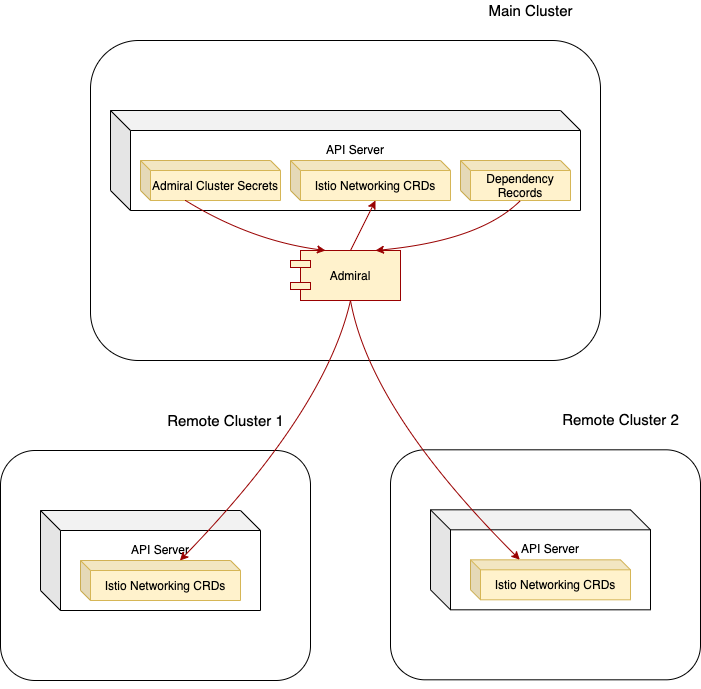

## Install

### Prerequisites

* One or more K8s clusters with K8s version 1.18 or above
* [Install istio control plane](https://istio.io/latest/docs/setup/install/multicluster/multi-primary_multi-network/) on each of these k8s clusters
* Configure DNS for service entries (hosts) ending in `global` - [Enable DNS proxy mode](https://istio.io/latest/docs/ops/configuration/traffic-management/dns-proxy/)

`Reference:` [Istio_multi-cluster models](https://istio.io/latest/docs/setup/install/multicluster/#deploy-the-istio-control-plane-in-each-cluster)

## Example Installations & Demos

### Production Deployment



An admiral production set up would have two types of clusters:
- cluster where admiral runs called the `main` cluster
- clusters which admiral watches, monitors and creates Istio CRs called the `remote` clusters

The requirements are different for the two types:
- admiral namespace will exist in the main cluster
- admiral-sync namespace will exist in remote clusters that admiral watches and monitors.

1\. Set necessary environment variables  

The following steps show how you can install admiral in the main cluster and then provision secrets for it to watch the remote clusters. 

```
While the process shown below using shell scripts is manual, automation can be built for 
i) installing admiral and its necessary resources (using a CD pipeline) 
ii) Provisioning secret for every new cluster created or upgraded as a post cluster create step
```

```bash
# Set main cluster env variable
export MAIN_CLUSTER=<path_to_kubeconfig_for_main_cluster>

# Set remote cluster env variable
export REMOTE_CLUSTER=<path_to_kubeconfig_for_remote_cluster>
```

2\. Install/Run Admiral in the main cluster

```bash
#Download and extract admiral

wget https://github.com/istio-ecosystem/admiral/releases/download/v1.2/admiral-install-v1.2.tar.gz
tar xvf admiral-install-v1.2.tar.gz

export ADMIRAL_HOME=./admiral-install-v1.2
```

```bash
#Install admiral
export KUBECONFIG=$MAIN_CLUSTER
$ADMIRAL_HOME/scripts/install_admiral.sh $ADMIRAL_HOME

```

3\. Add main cluster to Admiral's watcher

Since there are most likely other workloads running in the same cluster where admiral lives, admiral needs to watch the cluster it's currently living in as well. This step can be skipped if Admiral runs in a dedicated cluster.
Let admiral monitor the cluster it lives in by using the secret to talk to the API server of the cluster where it runs.

```
$ADMIRAL_HOME/scripts/cluster-secret.sh $MAIN_CLUSTER $MAIN_CLUSTER admiral
```

4\. Install/Run Admiral-Sync in the remote clusters that admiral monitors
```
# Create admiral role and bindings on remote cluster
kubectl apply --kubeconfig=$REMOTE_CLUSTER -f $ADMIRAL_HOME/yaml/remotecluster.yaml
```
5\. Add Remote Cluster to Admiral's watcher
```
# Create the k8s secret for admiral to monitor remote cluster.
$ADMIRAL_HOME/scripts/cluster-secret.sh $MAIN_CLUSTER $REMOTE_CLUSTER admiral
```

At this point, admiral is watching `remote cluster`

`Repeat steps 4 and 5 to add another remote cluster to be watched by Admiral.`

### Single cluster

#### Install/Run Admiral

```
#Download and extract admiral

wget https://github.com/istio-ecosystem/admiral/releases/download/v1.2/admiral-install-v1.2.tar.gz
tar xvf admiral-install-v1.2.tar.gz

export ADMIRAL_HOME=./admiral-install-v1.2
```

```
#Install Argo rollouts - Admiral is enabled by default to monitor rollouts resource, you can disable it, however the example installation is used to demo Argo rollouts as well.
# This is optional - More context - https://github.com/istio-ecosystem/admiral/issues/159
$ADMIRAL_HOME/scripts/install_rollouts.sh
```

```
#Install admiral
$ADMIRAL_HOME/scripts/install_admiral.sh $ADMIRAL_HOME

```

```
#Create the secret for admiral to monitor.

#Since this is for a single cluster demo the remote and local context are the same
$ADMIRAL_HOME/scripts/cluster-secret.sh $KUBECONFIG  $KUBECONFIG admiral
```
```
#Verify the secret
kubectl get secrets -n admiral
```

#### Deploy Sample Services

```
#Install test services & verify admiral did it's magic

$ADMIRAL_HOME/scripts/install_sample_services.sh $ADMIRAL_HOME

```

#### Http Demo

Now, run the command below that uses the CNAME generated by Admiral
```
kubectl exec --namespace=sample -it $(kubectl get pod -l "app=webapp" --namespace=sample -o jsonpath='{.items[0].metadata.name}') -c webapp -- curl -v http://stage.greeting.global
```

#### gRPC Demo

- As part of the sample services, a grpc service is also deployed and Admiral generates the corresponding CNAME. Apply the following yaml that will launch a pod which runs a gRPC client that will make gRPC calls to the generated CNAME.
```
kubectl apply -f $ADMIRAL_HOME/yaml/grpc-client.yaml -n sample
```

- Check the logs once the pod has run successfully (takes 10-20 seconds)
```
kubectl logs --namespace=sample $(kubectl get pod -l "app=grpc-client" --namespace=sample -o jsonpath='{.items[0].metadata.name}') -c grpc-client
```

- You should see a response like below
```
time="2020-11-04T00:11:28Z" level=debug msg="drive: 1 [0:10]"
time="2020-11-04T00:11:28Z" level=debug msg="drive: signal 1 0/10"
time="2020-11-04T00:11:28Z" level=debug msg="{0 0}: req"
time="2020-11-04T00:11:28Z" level=debug msg="{0 0}: rsp 12.622899ms"
time="2020-11-04T00:11:28Z" level=debug msg="recv 1 from {0 0}"
time="2020-11-04T00:11:29Z" level=debug msg="drive: 1 [0:10]"
time="2020-11-04T00:11:29Z" level=debug msg="drive: signal 2 0/10"
time="2020-11-04T00:11:29Z" level=debug msg="{1 0}: req"
time="2020-11-04T00:11:29Z" level=debug msg="{1 0}: rsp 7.780455ms"
time="2020-11-04T00:11:29Z" level=debug msg="recv 2 from {1 0}"
time="2020-11-04T00:11:29Z" level=debug msg=cleanup
{
  "good": 2,
  "bad": 0,
  "bytes": 0,
  "latency": {
    "p50": 7,
    "p75": 12,
    "p90": 12,
    "p95": 12,
    "p99": 12,
    "p999": 12
  },
  "jitter": {
    "p50": 0,
    "p75": 0,
    "p90": 0,
    "p95": 0,
    "p99": 0,
    "p999": 0
  }
}
```

#### Generated configuration

Admiral generated Istio configuration.  

##### ServiceEntry

Two service entries were created in the `admiral-sync` namespace.

```kubectl get ServiceEntry -n admiral-sync```

```
NAME                      HOSTS                    LOCATION        RESOLUTION   AGE
stage.greeting.global-se   [stage.greeting.global]   MESH_INTERNAL   DNS          76m
stage.webapp.global-se     [stage.webapp.global]     MESH_INTERNAL   DNS          76m
```

```kubectl get ServiceEntry stage.greeting.global-se  -n admiral-sync -o yaml```

Looking in more detail the hostname stage.greeting.global is pointing back the default k8s FQDNs

```
apiVersion: networking.istio.io/v1alpha3
kind: ServiceEntry
metadata:
  labels:
    identity: greeting
  name: stage.greeting.global-se
  namespace: admiral-sync
spec:
  addresses:
  - 240.0.10.2
  endpoints:
  - address: greeting.sample.svc.cluster.local
    locality: us-west-2
    ports:
      http: 80
  hosts:
  - stage.greeting.global
  location: MESH_INTERNAL
  ports:
  - name: http
    number: 80
    protocol: http
  resolution: DNS
```


### Multicluster

Finish steps from Single Cluster to have Admiral running and ready to watch other clusters (lets call them remote clusters) which we will be setting in the steps below.

Let's call the cluster used in Single cluster set up `Cluster 1`. Now we will use the steps below to add `Cluster 2` to the mesh and have it monitored by Admiral

Finish the steps from `Prerequisites` section for `Cluster 2`

#### Add Cluster 2 to Admiral's watcher
```
# Set CLUSTER_1 env variable
export CLUSTER_1=<path_to_kubeconfig_for_cluster_1>

# Set CLUSTER_2 env variable
export CLUSTER_2=<path_to_kubeconfig_for_cluster_2>
```

```
# Switch kubectx to Cluster 2
export KUBECONFIG=$CLUSTER_2
# Create admiral role and bindings on Cluster 2
kubectl apply -f $ADMIRAL_HOME/yaml/remotecluster.yaml
```

```
#Switch kubectx to Cluster 1
export KUBECONFIG=$CLUSTER_1

# Create the k8s secret for admiral to monitor Cluster 2.
$ADMIRAL_HOME/scripts/cluster-secret.sh $CLUSTER_1 $CLUSTER_2 admiral
```

At this point, admiral is watching `Cluster 2`

#### Deploy Sample Services in Cluster 2
```
#Switch kubectx to Cluster 2
export KUBECONFIG=$CLUSTER_2

#Install test services in Cluster 2

kubectl apply -f $ADMIRAL_HOME/yaml/remotecluster_sample.yaml
```

#### Verify

```
#Switch kubectx to Cluster 1
export KUBECONFIG=$CLUSTER_1

# Verify that the ServiceEntry for greeting service in Cluster 1 now has second endpoint (Cluster 2's istio-ingressgateway address)
kubectl get serviceentry stage.greeting.global-se -n admiral-sync -o yaml
```

#### Demo

Now run the below request multiple times and see the requests being load balanced between local (Cluster 1) and remote (Cluster 2) instances of greeting service (You can see the response payload change based on which greeting's instance served the request)

```
kubectl exec --namespace=sample -it $(kubectl get pod -l "app=webapp" --namespace=sample -o jsonpath='{.items[0].metadata.name}') -c webapp -- curl -v http://stage.greeting.global
```

### Global traffic policy

Multicluster example is a prerequisite for the below example with Cluster 2 hosted in us-east-2 region.

You can add a global traffic policy for the Greeting service to distribute traffic between clusters in a certain ratio. 

```bash
kubectl apply -f $ADMIRAL_HOME/yaml/gtp.yaml
```

Now, when you re-run demo requests, you should see 80% of them being served from the us-west-2 cluster (Cluster 1) and 20% of them being served from us-east-2 (Cluster 2).

`Note`: You can add locality to your pods in Cluster 2 by using K8s standard region labels if your cluster if not running on a cloud provider like AWS. See these [requirements](https://istio.io/docs/ops/configuration/traffic-management/locality-load-balancing/#requirements)

#### Argo-Rollouts 

#### Install Argo-rollouts
Refer [this](https://argoproj.github.io/argo-rollouts/) for details on Argo-Rollouts

```
kubectl create namespace argo-rollouts

kubectl apply -n argo-rollouts -f https://raw.githubusercontent.com/argoproj/argo-rollouts/stable/manifests/install.yaml
```

#### Deploy Sample Argo-Rollouts Services with Blue-Green stratergy
Refer [this](https://argoproj.github.io/argo-rollouts/features/bluegreen/) for details on Blue-Green stratergy with Argo-Rollouts

```
#Install test services

kubectl apply -f $ADMIRAL_HOME/yaml/sample-greeting-rollout-bluegreen.yaml
```
#### Demo

Now, run the command below that uses the CNAME generated by Admiral
```
kubectl exec --namespace=sample-rollout-bluegreen -it $(kubectl get pod -l "app=webapp" --namespace=sample-rollout-bluegreen -o jsonpath='{.items[0].metadata.name}') -c webapp -- curl -v http://stage.greeting.bluegreen.global

```


#### Deploy Sample Argo-Rollouts Services with Canary stratergy
Refer [this](https://argoproj.github.io/argo-rollouts/features/canary/) for details on Canary stratergy with Argo-Rollouts

```
#Install test services

kubectl apply -f $ADMIRAL_HOME/yaml/sample-greeting-rollout-canary.yaml
```

#### Demo

Now, run the command below that uses the CNAME generated by Admiral
```
kubectl exec --namespace=sample-rollout-canary -it $(kubectl get pod -l "app=webapp" --namespace=sample-rollout-canary -o jsonpath='{.items[0].metadata.name}') -c webapp -- curl -v http://stage.greeting.canary.global

```

### Cleanup

Run the following script to cleanup admiral and its associated resources

```bash
$ADMIRAL_HOME/scripts/cleanup.sh
```
